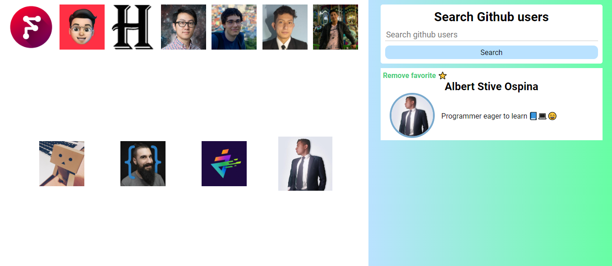

# User finder with Vue3

## Find users by their Github name

## Add to Favorites

## Select a user profile and it will display your information in the box on the right

## And I can also remove it from my favorites list

&copy; Stive Ospina :)

